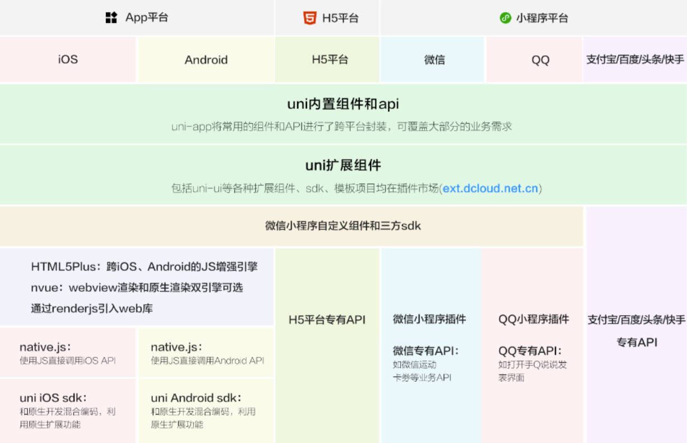
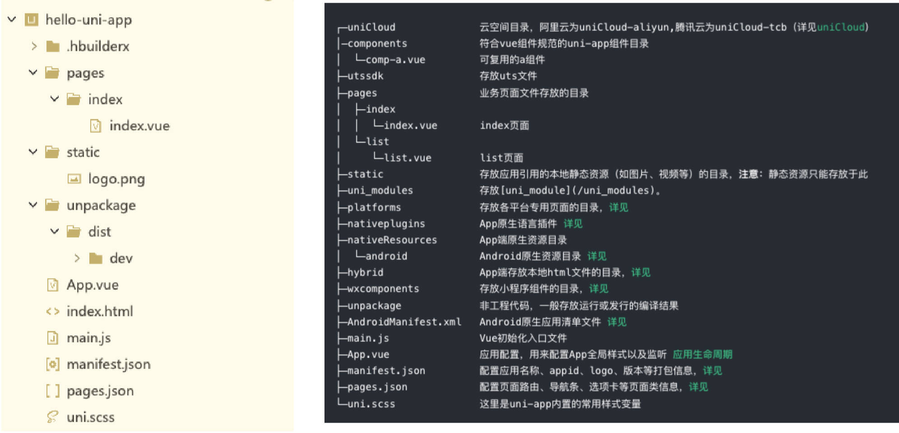

# 一、移动端开发

自从 iOS 和 Android 系统诞生以来，移动端开发主要由 iOS 和 Android 这两大平台占据。

传统移动端开发人员，主要是针对 iOS 和 Android 两个平台进行开发。

## 1.优点

性能优秀；

兼容性非常好；

能够使用硬件设备的所有功能，

- 比如：摄像头、罗盘等等。

总结：用户体验更好；

## 2.缺点

同时开发两个平台，时间成本和资源成本巨大。

纯原生开发的效率较低，严重影响应用快速迭代，不利于多个平台版本控制等。

发布的新版本必须重新下载应用。不利于推广。

总结：成本高（时间，资源）；迭代慢部署慢；应用须下载，不利于推广。

# 二、跨平台开发

原生开发存在诸多缺点；

“一套代码，多端运行”的跨平台理念应运而生。

## 1.优点

一套代码搞定 iOS、Android、微信小程序、H5 应用等多端应用。

开发成本较低，开发周期较短。

适用于跟系统交互少、页面不太复杂的场景。

## 2.缺点

对开发者要求高，除了本身对 web 前端的了解，还必须熟悉一点原生开发。

不适合做高性能、复杂的用户体验，以及定制高的应用程序。

- 比如：抖音、微信、QQ 等等。

同时开发多端兼容和适配比较麻烦、调试起来不方便。

# 三、跨平台发展史

2009 年以前，当时主要使用最原始的 HTML + CSS + JS 进行移动端 App 开发。

2009-2014 年间， 出现了 _PhoneGap_ 、_Cordova_ 跨平台框架，以及 _Ionic_ 轻量级的手机端 UI 库。

2015 年，_ReactNative_（跨平台框架）掀起了国内跨平台开发热潮，一些互联网大厂纷纷投入 _ReactNative_ 开发阵营。

2016 年，阿里开源了 _Weex_，它是一个可以使用现代化 Web 技术开发高性能原生应用的框架。

2017 年 Google I/O 大会上，Google 正式向外界公布了 _Flutter_，

- 一款跨平台开发工具包，用于为 Android、iOS、Web、Windows、Mac 等平台开发应用。

2017 年至今，微信小程序、_uni-app_（底层基于 Veex）、_Taro_（底层基于 ReactNative） 等一系列跨平台小程序框架陆续流行起来了。

# 四、方案选择

需要做高性能、复杂用户体验、定制高、硬件支持的应用程序，选原生开发；

需要性能较好、体验好、跨 Android、iOS、H5 平台、硬件支持的，选 Flutter（采用 Dart 开发）；

需要跨小程序、H5 平台、Android、iOS 平台、不太复杂的优先选 uni-app，其次选 Taro；

不需要扩平台的，选择对应技术框架即可。

# 五、跨平台方案对比。

| 类型     | Cordova                      | Xamarin               | ReactNative               | Weex                  | uni-app                           | Flutter                                           |
| -------- | ---------------------------- | --------------------- | ------------------------- | --------------------- | --------------------------------- | ------------------------------------------------- |
| 性能     | 低                           | 高                    | 较高                      | 中                    | 高                                | 高                                                |
| 上手难度 | 容易                         | 较高                  | 较高                      | 容易                  | 容易                              | 中                                                |
| 核心     | JavaScript                   | .NET                  | React                     | Weex                  | Vue                               | Dart                                              |
| 框架轻重 | 轻                           | 较重                  | 较重                      | 较轻                  | 轻                                | 重                                                |
| 特点     | 适合单页面                   | 适合开发整体 APP      | 适合开发整体 APP          | 适合单页面            | 适合开发整体 APP                  | 适合开发整体 APP                                  |
| 社区     | 活跃度低                     | 活跃度低              | 活跃度高（faceBook 维护） | 活跃度中（Apache 托管 | 活跃度高（DCloud 维护）           | 活跃度高（Google 维护）                           |
| 支持平台 | Android、IOS、Windows、MacOS | Android、IOS、Windows | Android、IOS、Web         | Android、IOS、Web     | Android、IOS、Web、小程序、快应用 | Android、IOS、Web、Windows、MacOS、Linux、Fuchsia |
| 适应性   | Web 开发学习成本低           | .NET、C#工程师开发。  | Web 开发学习成本低        | Web 开发学习成本低    | Web 开发学习成本低                | Java、C++、C# 开发学习成本低                      |

# 六、uni-app 是什么？

uni-app 中的 "uni"，意为 "unitive"，是统一的意思。

uni-app 是一个使用 Vue.js 开发前端应用的框架。

开发者编写一套代码，便可发布到 iOS、Android、Web（响应式）、各种小程序、快应用等多个平台。

# 七、uni-app 发展历史

DCloud 于 2012 年开始研发的小程序技术，并推出了 HBuilderX 开发工具。

2015 年，DCloud 正式商用了自己的小程序，产品名为“流应用”，

- 并捐献给了工信部旗下的 HTML5 中国产业联盟。

该应用能接近原生功能和性能的 App，并且即点即用，不需要安装。

> 微信团队经过分析，于 2016 年初决定上线微信小程序业务，但其没有接入中国产业联盟标准，而是订制了自己的标准。

# 七、uni-app 和小程序

## 1.相同点

都是接近原生的体验、打开即用、不需要安装。

都可开发微信小程序、都有非常完善的官方文档。

## 2.不同点

uni-app 支持跨平台，编写一套代码，可以发布到多个平台；<-> 微信小程序不支持。

uni-app 有 Vue 的体验、高效、统一、工程化强；<-> 微信小程序工程化弱，使用小程序开发语言。

uni-app 适合不太复杂的应用，可兼容多端，但增加了开发者心智负担；<-> 微信小程序适合较复杂、定制性较高、兼容和稳定性更好的应用。

# 八、uni-app 架构图



# 九、uni-app 初体验

创建 uni-app 项目的两种方式：

方式一：可视化界面（采用）。

- HBuilderX 内置了相关环境，开箱即用。

- 点工具栏里的文件 -> 新建 -> 项目（Ctrl + N）；

- 选择 uni-app 类型，输入工程名，选择默认模板，选择 Vue 版本，点击创建即可。

方式二：Vue-Cli

- 全局安装 Vue-CLI （目前仍推荐使用 vue-cli 4.x ）：

  ```shell
  npm install -g @vue/cli@4
  ```

- 创建项目

  ```shell
  vue create -p dcloudio/uni-preset-vue [my-project-name]
  ```

# 十、HBuilderX 开发工具

HbuilderX 是通用的前端开发工具，并为 uni-app 做了特别强化。

HBuilderX 从 v3.2.5（包含）开始优化了对 Vue3 的支持。

HBuilderX 支持各种表达式语法，如 less、scss、stylus、typescript 等高亮，无需安装插件

1.下载 HBuilderX，注册帐号。

- 用 Vue3 的 Composition API，建议用 HBuilderX Alpha 版，旧版有兼容问题。

  2.创建一个项目，点击起始标签页“新建项目”。

- 选择默认模板。
- 选择 Vue3 版本。

  3.运行该项目到 Chrome 浏览器。

- 在 HBuilderX 中，配置 Chrome 浏览器的安装路径。

  4.运行该项目到微信开发者工具。

- 在微信开发者工具中，开启服务端口：
  - 设置 - 安全设置 - 开启服务端口
- 在 HBuilderx 中，配置微信开发者工具的安装路径。

> 在微信开发者工具中，手动打开打包后的项目，路径是 `./unpackage/dist/dev/mp-weixin`

5.运行到手机模拟器：

1. 下载 mumu 模拟器。在其中新增一个 iphone6 尺寸的预设。
2. 在 HBuilderX 中，点击“运行在手机模拟器”，会自动下载 adb 调试桥。
3. 安卓端调试，要配置 **adb 调试桥命令行工具**。用于 HBuilderX 和 Android 模拟器建立连接，实时调试和热重载。

- 当点击“运行到手机模拟器”后，HBuilderX 会自动下载 adb 。

- adb 自动安装的，默认放在 HBuilderX 安装目录下的 `./plugins/launcher/tools/adbs`

- 在该目录下运行如下命令，即可使用 adb 命令。

  ```shell
  ./adb
  ```

  > 如果想要全局中使用 adb。需要为 adb 配置环境变量，
  >
  > 如果使用外部的 adb 插件，需要在 HBuilder 中配置 adb 的运行路径。

6. 执行如下命令：

   ```shell
   adb connect 127.0.0.1:7555 # mumu 模拟器，默认运行在 7555 端口。
   ```

# 十一、uni-app 项目目录结构



# 十二、uni-app 项目开发规范

为了实现多端兼容，综合考虑编译速度、运行性能等因素，uni-app 约定了如下开发规范：

- 页面文件，遵循 Vue 单文件组件 (SFC) 规范；
- 组件标签，靠近小程序规范，详见 uni-app 组件规范；
- 接口能力（JS API），靠近微信小程序规范，
  - 需将前缀 `wx` 替换为 `uni`。
- 数据绑定及事件处理同 Vue.js 规范，同时补充了 App 及页面的生命周期；
- 为兼容多端运行，建议使用 flex 布局进行开发，推荐使用 rpx 单位（750 设计稿）。

[uni-app 的官网文档](https://uniapp.dcloud.net.cn)

# 十三、main.js 文件

`main.js` 是 uni-app 的入口文件，主要作用是：

- 初始化 vue 实例。

- 定义全局组件。

- 定义全局属性。

- 安装插件，如 pinia、vuex 等。

./main.js

```javascript
import App from './App'

// #ifndef 条件编译。编译非 Vue3 版本时，执行如下代码。
import Vue from 'vue'
Vue.config.productionTip = false
App.mpType = 'app'
const app = new Vue({
  ...App
})
app.$mount()
// #endif

// #ifdef 条件编译。编译 Vue3 版本时，执行如下代码。
import { createSSRApp } from 'vue'
export function createApp() {
  const app = createSSRApp(App)
  return {
    app
  }
}
// #endif
```

# 十四、App.vue 文件

`App.vue` 是 uni-app 的入口组件，所有页面都是在 `App.vue` 下进行切换的。

`App.vue` 本身不是页面，这里不能编写视图元素，也就是没有 `<template>` 元素

`App.vue` 的作用：

- 应用的生命周期；

- 编写全局样式；

- 定义全局数据 `globalData`

> 【注意】：应用的生命周期仅可在 `App.vue` 中监听，在页面监听无效。

应用的生命周期

./App.vue

```vue
<script>
export default {
  onLaunch: function (options) {
    console.log('小程序应用启动参数 option：', options)
    console.log('App Launch')
  },
  onShow: function () {
    console.log('App Show')
  },
  onHide: function () {
    console.log('App Hide')
  }
}
</script>

<style>
/*每个页面公共css */
</style>
```

全局样式的编写：

01-hello-uniapp\static\css\common.css

```css
.name {
  color: blue;
}
```

01-hello-uniapp\static\css\common.less

```less
@mainColor: orange;
```

全局样式的导入：

01-hello-uniapp\App.vue

```vue
<script>
export default {
  onLaunch: function () {
    console.log('App Launch')
  },
  onShow: function () {
    console.log('App Show')
  },
  onHide: function () {
    console.log('App Hide')
  }
}
</script>

<style lang="less">
/* 每个页面公共css */
/* 默认已配置好别名 */
@import url(@/static/css/common.css);
@import url(@/static/css/common.less);
.title {
  color: red;
  border: 5px @mainColor solid;
}
</style>
```

全局样式在页面中应用：

01-hello-uniapp\pages\index\index.vue

```vue
<template>
  <view class="content">
    <view class="title">1.全局样式测试</view>
    <view class="name">2.全局样式测试</view>
  </view>
</template>
```
