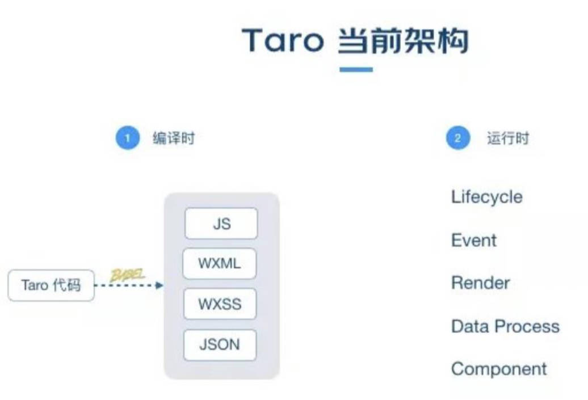
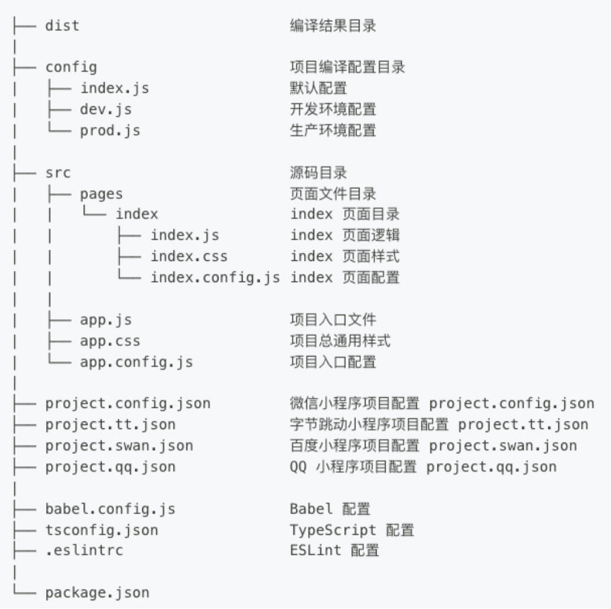

# 一、Taro 是什么？


Taro 是由京东凹凸实验室，打造的一个开放式跨端、跨框架解决方案，并于 2018 年 6 月 7 日正式开源；

Taro 支持使用【React / Vue / Preact】等框架来开发【微信/京东/百度/支付宝/字节跳动/QQ 等小程序 / H5 / RN 等应用】。

- 在 Taro 中，使用 Vue 只能开发 H5、小程序；
- 在 Taro 中，使用 React 可借助 ReactNative 开发 APP 端。

> 【注意】：
>
> Taro 并非直接支持开发 Andriod / IOS 应用，而是 RN 应用；
>
> 虽然 uni-app 支持开发原生 App，但主要还是用来做小程序多平台兼容，很少有多端兼容的需求。

# 二、跨平台发展历史

早期，IphoneGap Cordova

2015，ReactNative -> React

2016，Weex -> Vue

2017，Flutter

2017，weixin-miniapp，uni-app

2018，Taro

# 三、Taro 历史版本

Taro 1.x / 2.x 版的文档，现已**不再积极维护**。

2021 年 3 月，Taro 3.1 版本正式发布，主要改动是：打造开放式架构，支持以插件的形式，编译到任意小程序平台。

同年 4 月，Taro 3.2 版本正式发布，新增了对 ReactNative 的支持，主要是由 **58 同城团队**主导。

同年同月，Taro 3.3 alpha 发布，主要改动是：支持使用 HTML 标签进行开发。

2022 年 1 月，Taro 3.4 版本正式发布，主要改动是：支持使用 Preact（一个轻量的 react 框架） 和 Vue3.2 进行开发。


目前 Taro 团队的迭代重心在于 Taro 3。

# 四、Taro 的特点

多端支持

- Taro 3 支持编译到 H5、各小程序平台（**重心**）、RN。
- 目前官方支持的平台如下：
  - H5、RN；
  - 微信小程序，包括：
    - 京东小程序、百度小程序、支付宝小程序、字节跳动小程序 QQ 小程序、钉钉小程序、企业微信小程序、支付宝小程序等

多框架支持


- 在 Taro 3 中可以使用完整的 React / Vue / Nervjs（京东内部框架）/ Preact 开发体验

官方健仪：使用 Taro 开发 RN 应用前，先学习 RN 框架。

Taro 有自己 UI 的组件库：*Taro UI*；

- 仅对 weapp、h5 适配，目前不支持 RN。

# 五、Taro 对比 uni-app

跨端支持度（仅供参考，Taro 本身也在不断完善）。

| 平台         | 微信原生 | wepy | mpvue | taro                  | uni-app | chameleon                               |
| ------------ | -------- | ---- | ----- | --------------------- | ------- | --------------------------------------- |
| 微信小程序   | ✔        | ✔    | ✔     | ✔                     | ✔       | ✔                                       |
| 支付宝小程序 | ❌        | ❌    | ✔     | ✔                     | ✔       | 下拉刷新无法停止                        |
| 百度小程序   | ❌        | ❌    | ✔     | ✔                     | ✔       | 下拉刷新无法停止                        |
| 头条小程序   | ❌        | ❌    | ✔     | ✔                     | ✔       | ❌                                       |
| H5 端        | ❌        | ❌    | ❌     | 上拉加载/下拉刷新失败 | ✔       | 上拉加载/下拉刷新失败                   |
| App 端       | ❌        | ❌    | ❌     | 上拉加载失败          | ✔       | 列表无法滚动，无法测试上拉加载/下拉刷新 |

社区活跃度。

| 框架      | 官方技术支持         | 社区活跃度               |
| --------- | -------------------- | ------------------------ |
| wepy      | 官网微信已无法添加   | 无法入群，无法判断活跃度 |
| mpvue     | 较少                 | 气氛较活跃               |
| taro      | 较及时               | 气氛较活跃               |
| uni-app   | 较及时，较完善服务。 | 气氛活跃                 |
| chameleon | 较及时               | 气氛较活跃               |

资料完善度：

- Taro： 官方文档较完整，但不是很丰富，资料一般。

- uni-app：官方文档和各种专题内容很丰富，资料齐全。


工具和周边生态：

- Taro：官方组件库 Taro UI，只支持小程序和 H5（不支持 RN）；截至 2019 年 10 月 28 日， Taro 只有 64 个插件。
- uni-app：官方的 uni-ui 支持多端、周边模板丰富、完善的插件市场；截至到 2019 年 10 月 28 日，有 850 个插件。

总结：

- uni-app 在资料、生态、工具、开发效率、跨端数会比 Taro 略胜一筹。
- 当然 Taro 也有独特的优势，如：用 React 开发非常的灵活。

## 1.如何选择？

如需要跨平台（特别是小程序之间），并且应用不是很复杂，可选 Taro 和 uni-app。

- 如熟悉 Vue 优先选择 uni-app；
- 如熟悉 React 推荐使用 Taro。

# 六、Taro 架构理解

Taro 当前的架构主要分为：**编译时**和**运行时**。

编译时：主要是将 Taro 代码通过 Babel 转换成小程序的代码，如：JS、WXML、WXSS、JSON。

运行时：主要是进行一些：生命周期、事件、data 等部分的处理和对接，以保证和宿主平台数据的一致性。



# 七、开发工具选择

推荐 *VSCode* 或 *WebStorm*。

当使用 *VSCode* 时，推荐安装 *ESLint* 插件；

- 如果你使用 TypeScript，别忘了配置 `eslint.probe` 参数。

如果使用 Vue，推荐安装 *Vetur*(Vue3) 或 *Volar*(Vue2) 插件。

WebStorm 收费，但基本不需要配置。

不管使用 *VSCode* 还是 *WebStrom*，安装了上述插件之后，Taro 项目都能实现自动补全和代码实时检查（linting）的功能。

# 八、Taro 安装


Taro 项目基于 node（>= 12.0.0）；

Taro CLI 工具安装：

1. 全局安装 *@tarojs/cli* 脚手架。

```shell
npm i @tarojs/cli -g
```

2. 查看 Taro CLI 工具版本。

```shell
npm info @tarojs/cli
```

# 九、项目初始化

使用安装的脚手架，创建项目：

```shell
taro init [my-app]
```

npm 5.2+，可在没有全局安装 taro 脚手架的情况下，使用 npx 命令，创建 taro 项目：

```shell
npx @tarojs/cli init [my-app]
```

注意事项

- 开发支付宝小程序时，Webpack4 暂不支持使用 React18。
- 受小程序环境限制，诸如新 SSR Suspense 等特性将不能在小程序中使用。
-  RN 暂不支持 React18，需要等待 RN 官方输出支持方案。
- 官方文档：“为了顺利地用 Taro 来开发 App，我们强烈地建议您，先对 React Native 开发进行学习”。

# 十、项目编译运行

Taro 编译分为 dev 和 build 模式：

- dev 模式（增加 --watch 参数）将会监听文件修改。
- build 模式（去掉 --watch 参数）将不会监听文件修改，并会对代码进行压缩打包。

dev 命令启动 Taro 项目的开发环境：

```shell
npm run dev:h5 #启动 H5 端

npm run dev:weapp # 启动小程序端
```

build 命令，可以把 Taro 代码编译成不同端的代码，然后在对应的开发工具中查看效果，比如：

- H5 直接在浏览器中可以查看效果。
- 微信小程序需在《微信开发者工具》打开根目录下的 dist 查看效果。
- RN 应用需参考《React Native 端开发流程》。
- ...

运行项目到 h5 端；

通过注释，解决 eslint 报错。或者在 `.eslintrc` 里配置 `global` 全局变量。

.eslintrc

```json
{
  "globals": {
    "definePageConfig": "readonly",
    "defineAppConfig": "readonly",
  }
}
```

运行项目到小程序端：

需要手动打开小程序，并指定目录（dist 文件夹下)。

# 十一、目录结构分析



Taro 项目中的 `app.config.json` 相当于 uni-app 项目中的 `pages.json`，小程序项目中的 `app.json`；

是整个项目的配置文件。

# 十二、Taro + React 开发规范
为了实现多端兼容，综合考虑编译速度、运行性能等因素，Taro 可以约定了如下开发规范：

组件规范：

- 页面文件遵循 React 组件 (JSX) 规范。
- 组件标签靠近小程序规范（但遵从**大驼峰**，且必须**导包**，属性遵循**小驼峰**），详见 Taro 组件规范；
- 在 React 中使用 Taro 内置组件前，必须从 `@tarojs/components` 进行引入（导包）。

接口规范：

- 接口能力（JS API）靠近微信小程序规范，但需将前缀 `wx` 替换为 `Taro`（需导包），详见 Taro 接口规范；
- 数据绑定及事件处理同 React 规范，同时补充了 App 及页面的生命周期。

样式规范：

- 为兼容多端运行，建议使用 flex 布局进行开发，推荐使用 px 单位（750 设计稿）。


查看更多 [Taro 的官网文档](https://docs.taro.zone/docs)。


# 十三、Webpack 编译配置

编译配置存放于项目根目录下的 config 目录中，包含三个文件：

- `index.js` 是通用配置；
- `dev.js` 是项目开发时的配置；
- `prod.js` 是项目生产时的配置。

常用的配置：

- `projectName`：项目名称；
- `date`：项目创建时间；
- `designWidth`: 设计稿尺寸；
- `sourceRoot`：项目源码目录；
- `outputRoot`：项目打包的目录；
- `defineConstants`: 定义全局的变量（DefinePlugin）；
- `alias`: 配置路径别名；
- `mini`：用于微信小程序的配置。
- `h5.webpackChain`： webpack 配置；
- `h5.devServer`： 开发者服务配置。


[更多的配置](https://docs.taro.zone/docs/config)

在 `config\index.js` 定义项目中的全局常量：

```json
defineConstants: {
  VERSION: "'1.0.0'"
},
```

在 `config\index.js` 中为项目路径配置别名：

```js
import path from 'path'

const config = {
  alias: {
    "@": path.resolve(__dirname, "..", "src")
  }
}
```

# 十四、全局配置文件（app.config.js）

`app.config.js` 用来对小程序进行全局配置，配置项遵循微信小程序规范；

类似微信小程序的 `app.json`，并对所有平台进行统一；

| 属性                                                         | 类型         | 必填 | 描述               |
| ------------------------------------------------------------ | ------------ | ---- | ------------------ |
| [pages](https://docs.taro.zone/docs/next/app-config/#pages)  | String Array | 是   | 页面路径列表       |
| [window](https://docs.taro.zone/docs/next/app-config/#window) | Object       | 否   | 全局的默认窗口表现 |
| [tabBar](https://docs.taro.zone/docs/next/app-config/#tabbar) | Object       | 否   | 底部 tab 栏的表现  |
| [subPackages](https://docs.taro.zone/docs/next/app-config/#subpackages) | Object Array | 否   | 分包结构配置       |

[更多的配置](https://docs.taro.zone/docs/next/app-config)

> 【注意】：`window` 选项中的配置，h5 端大多不支持。

# 十五、页面配置文件（xxx.config.js）


小程序页面，使用 `xxx.config.js` 文件，来对窗口表现进行配置。

会覆盖全局配置 `app.config.json` 的 `window` 中相同的配置项。

文件须要 `export` 一个默认对象；

配置项遵循微信小程序规范，并且对所有平台进行统一。

[更多页面配置](https://docs.taro.zone/docs/next/page-config)

src\pages\index\index.config.js

```js
export default definePageConfig({
  navigationBarTitleText: '首页'
})
```

# 十七、项目配置（project.xxx.json）

为了适配不同的小程序平台， Taro 支持为各小程序平台添加各自项目配置文件。

默认的 `project.config.json` 配置只能用于微信小程序。常用配置：

- `libVersion` 小程序基础库版本；
- `projectname` 小程序项目名字；
- `appid` 小程序项目的 appid；
- `setting` 小程序项目编译配置。

各类小程序平台均有自己的项目配置文件，例如：

- 微信小程序，`project.config.json`
- 百度小程序，`project.swan.json`
- 字节跳动小程序，`project.tt.json`
- 支付宝小程序，`project.alipay.json`
- ...

[更多项目配置](https://docs.taro.zone/docs/next/project-config)

# 十六、入口组件（app.js）

每一个 Taro 应用，都需要一个入口组件（类似 React 组件）用来注册应用。

入口文件默认是 src 目录下的 `app.js`。

在入口 `app.js` 组件中可以：

定义应用的生命周期：
- `onLaunch` -对应 hook-> `useEffect`：在小程序环境中对应 app 的 `onLaunch`。
- `componentDidShow` -对应 hook-> `useDidShow`：在小程序环境中对应 app 的 `onShow`。
- `componentDidHide` -对应 hook-> `useDidHide`：在小程序环境中对应 app 的 `onHide`。
- [更多入口组件生命周期](https://docs.taro.zone/docs/react-entry#%E7%94%9F%E5%91%BD%E5%91%A8%E6%9C%9F%E6%96%B9%E6%B3%95)

定义全局数据：

- `taroGlobalData`

定义应用的全局状态：

- 使用 Redux (Vuex、Pinia)。

在 `app.js` 中，测试生命周期。

src\app.js

```js
import { Component } from 'react'
import './app.less'

class App extends Component {

  componentDidMount () {
    console.log('app componentDidMount')
  }

  // 应用的生命周期
  onLaunch() {
    console.log('app onLaunch')
  }

  componentDidShow () {
    console.log('app componentDidShow')
  }

  componentDidHide () {
    console.log('app componentDidHide')
  }

  render () {
    // this.props.children 是将要会渲染的页面
    return this.props.children
  }
}

export default App

```

在 `app.js` 中，定义全局数据。

```js
import { Component } from "react";
import "./app.less";

class App extends Component {

  componentDidMount() {
    console.log("app componentDidMount");
  }

  // taroGlobalData 要放在 componentDidMount 后面，否则会报 lint 警告
  taroGlobalData = {
    name: "zzt",
    age: 18,
    id: 111,
  };

  //...

  render() {
    // this.props.children 是将要会渲染的页面
    return this.props.children;
  }
}

export default App;

```

在页面中获取。

src\pages\index\index.jsx

```jsx
import { Component } from 'react'
import { View, Text } from '@tarojs/components' // 组件导报
import Taro from '@tarojs/taro'; // 导报
import './index.less'

export default class Index extends Component {

  componentWillMount () { }

  componentDidMount () {
    console.log('全局常量 VERSION:', VERSION);
    const app = Taro.getApp() // 不需要这样写：app.globalData.name
    console.log('app name:', app.name);
    console.log('app age:', app.age);
    console.log('app id:', app.id);
  }

  componentWillUnmount () { }

  componentDidShow () { }

  componentDidHide () { }

  render () {
    return (
      <View className='index'>
        <Text>Hello world haha!</Text>
      </View>
    )
  }
}
```

在 `aoo.less` 中，编写全局样式，并在 `app.js` 中引用。

```less
.global-style {
  color: red;
}
```

在页面中使用全局样式：

src\pages\index\index.jsx

```jsx
<View className='index global-style'>
  <Text>Hello world haha!</Text>
</View>
```

# 十七、常用内置组件

`View`：视图容器。用于包裹各种元素内容（Taro3.3 以后支持使用 HTML 标签进行开发）。

`Text`：文本组件。用于包裹文本内容。

`Button`: 按钮组件（多端主题色一样，默认绿色）。

`Image`：图片（H5 端默认为图片本身宽高，weapp 端为默认组件宽高）。

- 支持 JPG、PNG、SVG、WEBP、GIF 等格式和云文件 ID；
- 支持 `import` 导入 和网络图片 url；
- 不支持路径引用本地图片

`ScrollView`：可滚动视图区域，用于区域滚动。

- 竖向滚动时，需要给 `<ScrollView>` 一个固定高度，通过 css 设置 `height`
- 横向滚动时，需要给 `<ScrollView>` 添加 `white-space: nowrap;` 样式，子元素设置为**行内块级元素**。
- 适配小程序时，不要在 `<ScrollView>` 中使用 `<map>`、`<video>` `<canvas>`、`<textarea>` 等原生组件。

`Swiper`：滑块视图容器，一般用于轮播图，默认：宽 `100%`，高 `150px`。

---

新建一个页面 `01-cpns` 进行测试，在 `app.config.json` 文件中，注册该页面（放在第一位）。

src\app.config.js

```json
export default defineAppConfig({
  pages: [
    'pages/01-cpn/index',
    'pages/index/index'
  ],
})
```

重新编译项目；

编写页面：

src\pages\01-cpn\index.jsx

```jsx
import { Component } from 'react';
// 引用的原生组件，都要导包
import { View, Text, Button, Image, ScrollView, Swiper, SwiperItem } from '@tarojs/components';
// 导入图片
import BannerImg01 from '@/assets/images/banner/banner01.jpeg';
import BannerImg02 from '@/assets/images/banner/banner02.jpeg';
import BannerImg03 from '@/assets/images/banner/banner03.jpeg';
import EmptyCartImg from '@/assets/images/empty_cart.png';
import HomeImg from '../../assets/images/tabbar/home_active.png';

import './index.less';

export default class CpnsTaro extends Component {
  
  render() {
    return (
      <View>
        <View>
          <Text>我是一个 Text</Text>
        </View>
        <Button type='primary'>我是一个 Button</Button>

        {/* 图片 <Image> 组件不支持路径引用本地图片，只能通过 ESModule 模块导入的形式。*/}
        {/* h5 端用的是图片本身大小，小程序端有默认宽高。 */}
        <Image className='image' src={EmptyCartImg}></Image>
        <Image className='image' src={HomeImg}></Image>
        <Image
          className='image'
          src='https://www.baidu.com/img/PCtm_d9c8750bed0b3c7d089fa7d55720d6cf.png'
        ></Image>

        {/* ScrollView */}
        <ScrollView scrollY className='h-scroll'>
          <View className='h-item'>item1</View>
          <View className='h-item'>item1</View>
          <View className='h-item'>item1</View>
          <View className='h-item'>item1</View>
          <View className='h-item'>item1</View>
          <View className='h-item'>item8</View>
          <View className='h-item'>item9</View>
          <View className='h-item'>item10</View>
        </ScrollView>

        <ScrollView scrollX className='w-scroll'>
          <View className='w-item'>item1</View>
          <View className='w-item'>item1</View>
          <View className='w-item'>item1</View>
          <View className='w-item'>item1</View>
          <View className='w-item'>item1</View>
          <View className='w-item'>item8</View>
          <View className='w-item'>item9</View>
          <View className='w-item'>item10</View>
        </ScrollView>

        {/* 轮播图组件 */}
        <Swiper className='banner' indicatorDots indicatorActiveColor='#ff464e'>
          <SwiperItem>
            <Image className='banner-img' src={BannerImg01}></Image>
          </SwiperItem>
          <SwiperItem>
            <Image className='banner-img' src={BannerImg02}></Image>
          </SwiperItem>
          <SwiperItem>
            <Image className='banner-img' src={BannerImg03}></Image>
          </SwiperItem>
        </Swiper>
      </View>
    );
  }
}

```

src\pages\01-cpn\index.less

```less
// 也是属于全局样式
.image {
  width: 200px;
  height: 200px;
}

.h-scroll {
  height: 400px;
  background-color: pink;
}

.w-item {
  height: 200px;
  border-bottom: 2px solid green;
}

.w-scroll {
  white-space: nowrap;
  background-color: purple;
}

.w-item {
  display: inline-block;
  height: 200px;
  width: 200px;
  border-right: 1px solid green;
}

.banner-img {
  width: 100%;
  height: 100%;
}
```

Taro UI 是 Taro 提供的 UI 组件库，使用时，要按需引入。

# 十八、配置 prettier

安装 *prettier*：

```shell
npm install prettier -D
```

消除与 eslint 冲突，[参考文档](https://juejin.cn/post/7012160233061482532)：

安装依赖：

```shell
npm install eslint-plugin-prettier eslint-config-prettier -D
```

配置 `.eslintrc`：

```json
{
  "extends": [
    //...
    "prettier"
  ],
}
```


